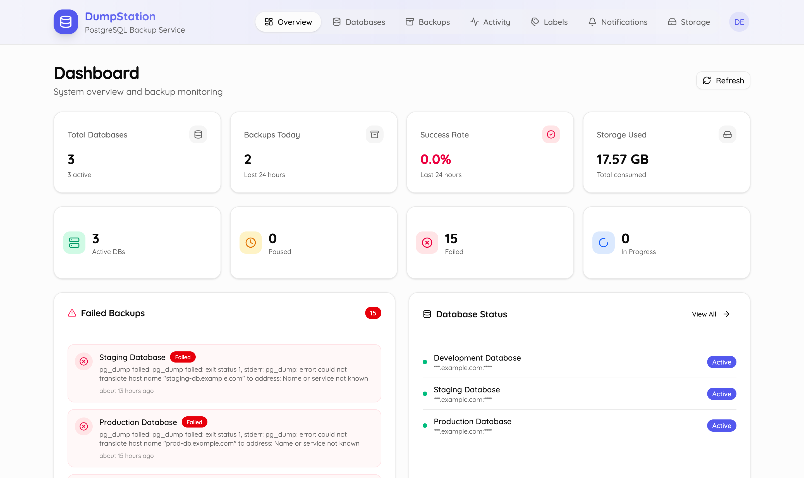
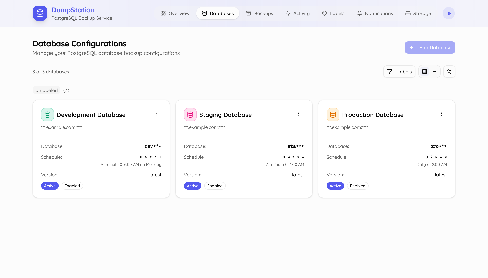
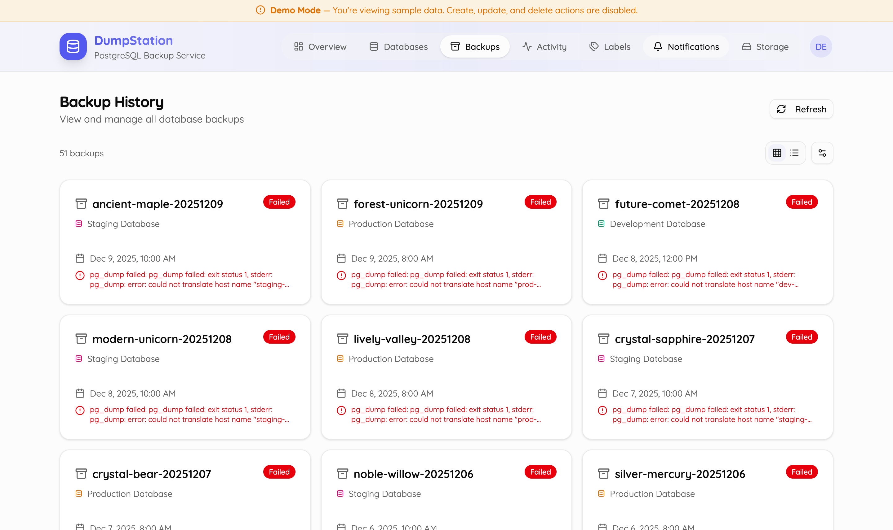
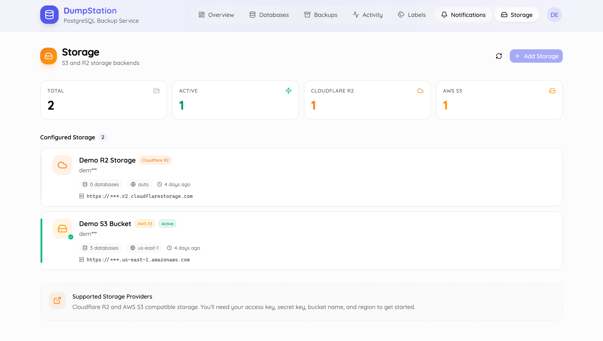

<div align="center">
  
  
  # 🗄️ DumpStation
  
  **Self-Hosted PostgreSQL Backup Management System**
  
  Automate your database backups with cloud storage integration, Discord notifications, and a modern web interface.
  
  [](https://opensource.org/licenses/MIT)
  [](https://go.dev/)
  [](https://react.dev/)
  [](https://www.docker.com/)
  [](https://dumpstation.monzim.com)
  
  [Features](#-features) • [Quick Start](#-quick-start) • [Documentation](#-documentation) • [Contributing](#-contributing) • [License](#-license)
  
</div>

---

## 📖 Overview

**DumpStation** is a production-ready, self-hosted solution for managing PostgreSQL database backups. It combines automated scheduling, cloud storage integration, and real-time notifications in a single, easy-to-deploy application.

Perfect for DevOps teams, solo developers, and organizations that need reliable, automated database backups without vendor lock-in.

### 🎯 Why DumpStation?

- **🔒 Self-Hosted**: Full control over your data and backups
- **☁️ Cloud Native**: Native support for AWS S3, Cloudflare R2, and MinIO
- **🤖 Automated**: Set it and forget it with cron-based scheduling
- **🔔 Real-time Alerts**: Discord notifications for backup status
- **🎨 Modern UI**: Beautiful, responsive dashboard built with React
- **🐳 Docker Ready**: Deploy in minutes with Docker Compose
- **🔐 Secure**: JWT authentication, 2FA support, multi-tenant isolation
- **📊 Multi-Version**: Supports PostgreSQL 12, 13, 14, 15, 16, and 17

---

## ✨ Features

### 🗃️ Database Management

- **Multi-Database Support**: Manage unlimited PostgreSQL databases from a single interface
- **Version Compatibility**: Automatic version detection and tool selection (PostgreSQL 12-17)
- **Connection Testing**: Verify database connections before scheduling
- **Pause/Resume**: Temporarily disable backups without losing configuration
- **User Isolation**: Multi-tenant architecture with strict data separation

### ⏰ Flexible Scheduling

- **Cron-Based Scheduling**: Use familiar cron expressions for backup timing
- **Manual Triggers**: Run backups on-demand whenever needed
- **Automatic Rotation**: Keep last N backups or retain for M days
- **Smart Cleanup**: Automatic deletion of old backups based on your policy

### ☁️ Cloud Storage Integration

- **Multiple Providers**: AWS S3, Cloudflare R2, MinIO support
- **Flexible Configuration**: Different storage for different databases
- **Reusable Configs**: Share storage settings across multiple databases
- **S3-Compatible**: Works with any S3-compatible storage service

### 🔄 Backup & Restore

- **One-Click Backup**: Trigger backups manually with a single click
- **Human-Readable Names**: Auto-generated memorable backup names (`swift-falcon-20251208`)
- **Full Restore**: Restore to same database or different target
- **Cross-Server Restore**: Restore backups to any PostgreSQL server
- **Version-Aware**: Uses correct pg_dump/pg_restore for each database version

### 🔔 Discord Integration

- **Passwordless Login**: Authenticate using Discord OTP
- **Real-time Notifications**: Get instant alerts for backup success/failure
- **Customizable Alerts**: Configure notifications per database
- **System Events**: Receive alerts for important system events

### 🔐 Security & Authentication

- **JWT Authentication**: Secure token-based API access
- **Discord OTP**: Passwordless login via Discord webhooks
- **TOTP 2FA**: Optional two-factor authentication
- **Backup Codes**: Recovery codes for 2FA emergencies
- **Role-Based Access**: Admin, demo, and regular user roles
- **Activity Logging**: Comprehensive audit trail of all operations

### 📊 Monitoring & Analytics

- **Real-time Dashboard**: View system statistics at a glance
- **Backup History**: Track all backups with detailed status
- **Activity Logs**: Searchable logs of all system operations
- **Storage Metrics**: Monitor total storage usage
- **Success Rates**: Track backup success/failure statistics

### 🎨 Modern User Interface

- **Responsive Design**: Works perfectly on desktop, tablet, and mobile
- **Dark/Light Mode**: Choose your preferred theme
- **Interactive Components**: Built with Radix UI and shadcn/ui
- **Real-time Updates**: Live dashboard updates via React Query
- **Intuitive Navigation**: Clean, modern interface that's easy to use

---

## 🚀 Quick Start

### Prerequisites

- **Docker** and **Docker Compose** installed
- **Discord Webhook URL** for authentication and notifications ([Create one](https://support.discord.com/hc/en-us/articles/228383668-Intro-to-Webhooks))
- **PostgreSQL Database** to backup (can be local or remote)
- **Cloud Storage** (AWS S3, Cloudflare R2, or MinIO)

### Installation

1. **Clone the repository**

```bash
git clone https://github.com/monzim/dumpstation.git
cd dumpstation
```

2. **Configure environment variables**

```bash
# Copy example environment file
cp server/.env.example server/.env

# Edit the configuration
nano server/.env
```

**Essential configuration:**

```env
# Database (for DumpStation itself)
DB_HOST=postgres
DB_PORT=5432
DB_USER=postgres
DB_PASSWORD=your_secure_password
DB_NAME=backup_service

# JWT Secret (generate a secure random string)
JWT_SECRET=your-super-secret-jwt-key-change-this

# Discord Webhook (required for authentication)
DISCORD_WEBHOOK_URL=https://discord.com/api/webhooks/YOUR_WEBHOOK_URL

# System Admin User
SYSTEM_USERNAME=admin
SYSTEM_EMAIL=admin@yourdomain.com
```

3. **Start the services**

```bash
cd server
docker-compose up -d
```

This will start:

- **DumpStation API** on `http://localhost:8080`
- **PostgreSQL Database** (DumpStation's internal database)
- **MinIO** (local S3-compatible storage for testing) on `http://localhost:9000`

4. **Access the web interface**

The React frontend can be run locally or deployed to Cloudflare Workers.

**Option A: Local Development**

```bash
cd web
pnpm install
pnpm dev
```

Visit `http://localhost:7511`

**Option B: Use the live demo**

Visit [https://dumpstation.monzim.com](https://dumpstation.monzim.com)

5. **Login**

- Click "Login with Discord"
- Check your Discord channel for the OTP code
- Enter the code to authenticate

6. **Add your first database backup**

- Navigate to **Databases** → **Add Database**
- Enter your PostgreSQL connection details
- Configure storage (S3/R2/MinIO)
- Set backup schedule (cron expression)
- Set rotation policy
- Save and test the connection

Your first backup will run according to the schedule, or you can trigger it manually!

---

## 📚 Documentation

### 📖 Full Documentation

- **[Deployment Guide](docs/DEPLOYMENT.md)** - Detailed deployment instructions for production
- **[Contributing Guide](CONTRIBUTING.md)** - How to contribute to the project
- **[API Documentation](http://localhost:8080/swagger/)** - Interactive Swagger/OpenAPI docs
- **[Backend README](server/README.md)** - Server architecture and development
- **[Frontend README](web/README.md)** - Web interface development
- **[Roadmap](ROADMAP.md)** - Planned features and milestones

### 🔧 Configuration Reference

| Variable                 | Description                            | Required | Default                  |
| ------------------------ | -------------------------------------- | -------- | ------------------------ |
| `SERVER_PORT`            | API server port                        | No       | `8080`                   |
| `DB_HOST`                | PostgreSQL host (DumpStation DB)       | Yes      | `localhost`              |
| `DB_PORT`                | PostgreSQL port                        | Yes      | `5432`                   |
| `DB_USER`                | Database username                      | Yes      | `postgres`               |
| `DB_PASSWORD`            | Database password                      | Yes      | -                        |
| `DB_NAME`                | Database name                          | Yes      | `backup_service`         |
| `JWT_SECRET`             | Secret for JWT signing                 | Yes      | -                        |
| `JWT_EXPIRATION_MINUTES` | JWT token lifetime                     | No       | `10`                     |
| `DISCORD_WEBHOOK_URL`    | Discord webhook for auth/notifications | Yes      | -                        |
| `OTP_EXPIRATION_MINUTES` | OTP code expiration                    | No       | `5`                      |
| `SYSTEM_USERNAME`        | Initial admin username                 | No       | `root`                   |
| `SYSTEM_EMAIL`           | Initial admin email                    | No       | `root@dumpstation.local` |

### 🐳 Docker Deployment

**Production Deployment:**

```bash
cd server
docker-compose -f docker-compose.prod.yml up -d
```

**Using External PostgreSQL:**

Update `docker-compose.prod.yml` to point to your external database:

```yaml
environment:
  DB_HOST: your-postgres-host.example.com
  DB_PORT: 5432
  DB_USER: dumpstation
  DB_PASSWORD: ${DB_PASSWORD}
  DB_NAME: dumpstation_prod
```

**Behind Reverse Proxy:**

See [docs/DEPLOYMENT.md](docs/DEPLOYMENT.md) for nginx and Caddy configuration examples.

---

## 🏗️ Architecture

### Technology Stack

**Backend:**

- **Language**: Go 1.24+
- **Framework**: net/http with gorilla/mux
- **ORM**: GORM with PostgreSQL
- **Authentication**: JWT + Discord OTP + TOTP 2FA
- **Scheduling**: robfig/cron
- **Storage**: AWS SDK (S3/R2 compatible)
- **API Docs**: Swagger/OpenAPI

**Frontend:**

- **Framework**: React 19.2
- **Build Tool**: Vite 7
- **Router**: TanStack Router
- **State**: TanStack Query (React Query)
- **UI**: Radix UI + shadcn/ui + Tailwind CSS
- **Deployment**: Cloudflare Workers

**Infrastructure:**

- **Database**: PostgreSQL 15+ (for DumpStation)
- **Target DBs**: PostgreSQL 12-17 (databases to backup)
- **Storage**: AWS S3, Cloudflare R2, MinIO
- **Container**: Docker with multi-stage builds

### System Architecture

```
┌─────────────────┐
│  React Frontend  │ (TanStack Router + React Query)
│   (Port 7511)    │
└────────┬────────┘
         │ HTTP/REST
         ▼
┌─────────────────┐
│   Go Backend     │ (JWT Auth + Middleware)
│   (Port 8080)    │
└────┬───┬────┬───┘
     │   │    │
     │   │    └─────────────────┐
     │   │                      │
     │   ▼                      ▼
     │  ┌──────────────┐   ┌─────────────┐
     │  │  PostgreSQL  │   │   Discord   │
     │  │  (Internal)  │   │   Webhook   │
     │  └──────────────┘   └─────────────┘
     │
     ▼
┌──────────────────────┐
│   Backup Service      │
│  - Scheduler (cron)   │
│  - pg_dump Runner     │
│  - Version Manager    │
└─────┬────────────────┘
      │
      ├──────────────┬─────────────┐
      ▼              ▼             ▼
  ┌────────┐    ┌────────┐    ┌────────┐
  │   S3    │    │   R2   │    │ MinIO  │
  └────────┘    └────────┘    └────────┘
```

---

## 🎯 Use Cases

### For Solo Developers

- Automated backups for personal projects
- Multiple project databases from one dashboard
- Discord notifications on backup status
- Easy restore for development/testing

### For Small Teams

- Centralized backup management
- Multi-user access with isolation
- Shared storage configurations
- Activity logging and audit trails

### For Organizations

- Multi-tenant architecture
- Role-based access control
- Comprehensive monitoring and statistics
- Production-ready with Docker deployment

---

## 🤝 Contributing

We welcome contributions from the community! Whether it's bug fixes, new features, documentation improvements, or feedback, all contributions are appreciated.

### Quick Links

- **[Contributing Guide](CONTRIBUTING.md)** - How to get started
- **[Code of Conduct](CODE_OF_CONDUCT.md)** - Our community standards
- **[Issue Tracker](https://github.com/monzim/dumpstation/issues)** - Report bugs or request features
- **[Discussions](https://github.com/monzim/dumpstation/discussions)** - Ask questions and share ideas

### Development Setup

```bash
# Backend
cd server
make deps
make dev

# Frontend
cd web
pnpm install
pnpm dev
```

See [CONTRIBUTING.md](CONTRIBUTING.md) for detailed development guidelines.

---

## 📸 Screenshots

<div align="center">
  
### Dashboard

*Overview with real-time statistics and recent backups*

### Database Management


_Manage multiple databases with flexible scheduling_

### Backup History


_Track all backups with detailed status and one-click restore_

### Storage Configuration


_Configure S3, R2, or MinIO storage providers_

</div>

---

## 🗺️ Roadmap

See [ROADMAP.md](ROADMAP.md) for planned features and version milestones.

**Upcoming Features:**

- 📧 Email notification support
- 🔐 Backup encryption at rest
- ✅ Automated backup verification
- 📈 Grafana metrics integration
- 🌍 Multi-region storage replication
- 📦 Incremental backups with WAL archiving

---

## 📝 License

This project is licensed under the **MIT License** - see the [LICENSE](LICENSE) file for details.

```
MIT License

Copyright (c) 2025 Monzim (https://monzim.com)

Permission is hereby granted, free of charge, to any person obtaining a copy
of this software and associated documentation files (the "Software"), to deal
in the Software without restriction, including without limitation the rights
to use, copy, modify, merge, publish, distribute, sublicense, and/or sell
copies of the Software, and to permit persons to whom the Software is
furnished to do so, subject to the following conditions:

The above copyright notice and this permission notice shall be included in all
copies or substantial portions of the Software.
```

---

## 🙏 Acknowledgments

- Built with ❤️ by [Monzim](https://monzim.com)
- UI components from [shadcn/ui](https://ui.shadcn.com/)
- Icons from [Lucide](https://lucide.dev/)
- Inspired by the need for simple, reliable database backups

---

## 📬 Contact & Support

- **Website**: [monzim.com](https://monzim.com)
- **Live Demo**: [dumpstation.monzim.com](https://dumpstation.monzim.com)
- **Email**: [me@monzim.com](mailto:me@monzim.com)
- **Issues**: [GitHub Issues](https://github.com/monzim/dumpstation/issues)
- **Discussions**: [GitHub Discussions](https://github.com/monzim/dumpstation/discussions)

---

## ⭐ Star History

If you find this project useful, please consider giving it a star! It helps others discover the project.

[](https://star-history.com/#monzim/dumpstation&Date)

---

<div align="center">
  
  **Made with ❤️ for the open-source community**
  
  [⬆ Back to Top](#️-dumpstation)
  
</div>
