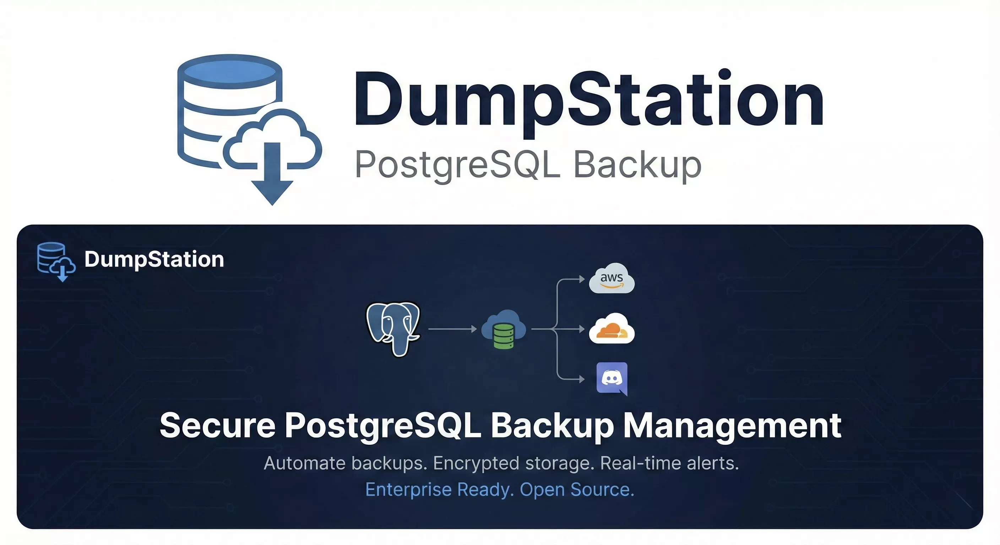

<!-- show the public og image web/public/images/og.webp in center-->

# DumpStation

<div align="center">
  
</div>

</br>

<div align="center">


**A comprehensive, self-hosted PostgreSQL backup management system with a modern web interface**

[](https://golang.org)
[](https://react.dev)
[](https://typescriptlang.org)
[](https://postgresql.org)
[](https://docker.com)
[](LICENSE)

[Features](#-features) • [Quick Start](#-quick-start) • [Documentation](#-documentation) • [Screenshots](#-screenshots) • [API](#-api-documentation)

</div>

---

## 📋 Overview

DumpStation is a powerful, self-hosted solution for automating PostgreSQL database backups. It provides a RESTful API backend built with Go and a modern web dashboard built with React, making it easy to manage, schedule, and monitor backups across multiple databases.

Perfect for DevOps teams, solo developers, and organizations that need reliable, automated database backups with Discord notifications and cloud storage integration.

## ✨ Features

### 🗄️ Database Management

- **Multi-Database Support** — Manage backups for unlimited PostgreSQL databases
- **Multi-Version Compatibility** — Supports PostgreSQL 12, 13, 14, 15, 16, and 17
- **Connection Testing** — Validate database connections before scheduling backups
- **Flexible Configuration** — Custom settings per database

### ⏰ Backup Scheduling

- **Cron-Based Scheduling** — Flexible scheduling using standard cron expressions
- **Manual Backups** — Trigger on-demand backups anytime
- **Pause/Resume** — Temporarily pause scheduled backups without deletion

### 📦 Storage & Rotation

- **Cloud Storage** — AWS S3 and Cloudflare R2 support
- **Shared Storage** — Use the same storage bucket across multiple databases
- **Automatic Rotation** — Count-based (keep last N) or time-based (keep N days)
- **Storage Metrics** — Track storage usage per database and overall

### 🔔 Notifications

- **Discord Integration** — Real-time backup status notifications via webhooks
- **Customizable Alerts** — Configure notifications per database
- **OTP Authentication** — Secure login via Discord webhook OTP

### 📊 Monitoring & Analytics

- **Real-Time Dashboard** — Visual overview of backup health
- **Success/Failure Rates** — Track backup reliability metrics
- **Activity Logs** — Complete audit trail of all operations
- **Storage Analytics** — Monitor storage consumption trends

### 🔐 Security

- **JWT Authentication** — Secure API access with JSON Web Tokens
- **Discord OTP** — Passwordless authentication via Discord
- **Non-Root Container** — Security-hardened Docker image
- **Credential Encryption** — Secure storage of sensitive data

### 🎨 Modern Web Interface

- **Responsive Design** — Works on desktop, tablet, and mobile
- **Dark/Light Mode** — Theme support for comfortable viewing
- **Real-Time Updates** — Live dashboard with auto-refresh
- **Intuitive UX** — Clean, modern interface built with shadcn/ui

## 🏗️ Architecture

```
┌─────────────────────────────────────────────────────────────────┐
│                         DumpStation                              │
├─────────────────────────────────────────────────────────────────┤
│                                                                  │
│  ┌─────────────┐     ┌─────────────┐     ┌─────────────┐       │
│  │   Web App   │────▶│  REST API   │────▶│  PostgreSQL │       │
│  │   (React)   │     │    (Go)     │     │  (Service)  │       │
│  └─────────────┘     └──────┬──────┘     └─────────────┘       │
│         │                   │                                   │
│         │            ┌──────┴──────┐                           │
│         │            │             │                            │
│         ▼            ▼             ▼                            │
│  ┌───────────┐  ┌─────────┐  ┌──────────┐  ┌─────────────┐    │
│  │ Cloudflare│  │ Discord │  │   S3/R2  │  │  Target DBs │    │
│  │  Workers  │  │ Webhooks│  │  Storage │  │  (PG 12-17) │    │
│  └───────────┘  └─────────┘  └──────────┘  └─────────────┘    │
│                                                                  │
└─────────────────────────────────────────────────────────────────┘
```

### Project Structure

```
db_proxy/
├── server/                 # Go Backend API
│   ├── cmd/server/         # Application entry point
│   ├── internal/           # Core business logic
│   │   ├── auth/           # JWT & OTP authentication
│   │   ├── backup/         # Backup execution engine
│   │   ├── config/         # Configuration management
│   │   ├── database/       # Database connections
│   │   ├── handlers/       # HTTP request handlers
│   │   ├── middleware/     # Auth, CORS, logging
│   │   ├── models/         # Data models
│   │   ├── notification/   # Discord notifications
│   │   ├── repository/     # Data access layer
│   │   ├── scheduler/      # Cron job scheduling
│   │   └── storage/        # S3/R2 operations
│   ├── migrations/         # SQL migrations
│   ├── docs/               # Swagger/OpenAPI docs
│   └── Dockerfile          # Multi-stage Docker build
│
└── web/                    # React Frontend
    ├── src/
    │   ├── components/     # UI components
    │   ├── lib/            # API clients & utilities
    │   └── routes/         # TanStack Router pages
    └── wrangler.jsonc      # Cloudflare Workers config
```

## 🚀 Quick Start

### Prerequisites

- **Docker & Docker Compose** (recommended) OR
- **Go 1.24+** and **Node.js 20+**
- **PostgreSQL** (for the service database)
- **pg_dump & psql** CLI tools
- **Discord Webhook URL** (for notifications & auth)

### Option 1: Docker Compose (Recommended)

```bash
# Clone the repository
git clone https://github.com/monzim/db_proxy.git
cd db_proxy/server

# Configure environment
cp .env.example .env
# Edit .env with your Discord webhook URL and other settings

# Start all services
docker-compose up -d

# View logs
docker-compose logs -f backup-service
```

**Services Started:**

- 🌐 **API Server**: http://localhost:8080
- 📖 **Swagger UI**: http://localhost:8080/swagger/index.html
- 🗄️ **MinIO Console**: http://localhost:9001 (for local S3 testing)

### Option 2: Manual Setup

#### Backend (Go)

```bash
cd server

# Install dependencies
go mod download

# Setup database
createdb backup_service

# Configure environment
cp .env.example .env
# Edit .env with your configuration

# Run the server
make dev
# OR
go run cmd/server/main.go
```

#### Frontend (React)

```bash
cd web

# Install dependencies
pnpm install

# Start development server
pnpm dev
```

Frontend will be available at http://localhost:3000

## 📖 Documentation

### Authentication Flow

1. **Request OTP**

   ```bash
   curl -X POST http://localhost:8080/api/v1/auth/login
   ```

   Check your Discord webhook for the 6-digit OTP code.

2. **Verify OTP & Get Token**

   ```bash
   curl -X POST http://localhost:8080/api/v1/auth/verify \
     -H "Content-Type: application/json" \
     -d '{"otp": "123456"}'
   ```

3. **Use JWT Token**
   ```bash
   curl -H "Authorization: Bearer YOUR_TOKEN" \
     http://localhost:8080/api/v1/databases
   ```

### Setting Up Your First Backup

#### 1. Add Storage Configuration

```bash
curl -X POST http://localhost:8080/api/v1/storage \
  -H "Authorization: Bearer $TOKEN" \
  -H "Content-Type: application/json" \
  -d '{
    "name": "Production Backups",
    "provider": "r2",
    "bucket": "my-backups",
    "region": "auto",
    "endpoint": "https://account-id.r2.cloudflarestorage.com",
    "access_key": "your-access-key",
    "secret_key": "your-secret-key"
  }'
```

#### 2. Add Notification Channel (Optional)

```bash
curl -X POST http://localhost:8080/api/v1/notifications \
  -H "Authorization: Bearer $TOKEN" \
  -H "Content-Type: application/json" \
  -d '{
    "name": "DevOps Alerts",
    "discord_webhook_url": "https://discord.com/api/webhooks/..."
  }'
```

#### 3. Configure Database for Backup

```bash
curl -X POST http://localhost:8080/api/v1/databases \
  -H "Authorization: Bearer $TOKEN" \
  -H "Content-Type: application/json" \
  -d '{
    "name": "Production Database",
    "host": "db.example.com",
    "port": 5432,
    "dbname": "production",
    "user": "backup_user",
    "password": "secure_password",
    "schedule": "0 2 * * *",
    "storage_id": "storage-uuid-here",
    "notification_id": "notification-uuid-here",
    "rotation_policy": {
      "type": "days",
      "value": 30
    }
  }'
```

#### 4. Trigger Manual Backup (Optional)

```bash
curl -X POST http://localhost:8080/api/v1/databases/{id}/backup \
  -H "Authorization: Bearer $TOKEN"
```

### Cron Schedule Examples

| Schedule         | Expression     |
| ---------------- | -------------- |
| Daily at 2 AM    | `0 2 * * *`    |
| Every 6 hours    | `0 */6 * * *`  |
| Weekly on Sunday | `0 0 * * 0`    |
| Monthly on 1st   | `0 3 1 * *`    |
| Every 30 minutes | `*/30 * * * *` |

### Backup Rotation Policies

**Count-based** — Keep last N backups:

```json
{ "rotation_policy": { "type": "count", "value": 7 } }
```

**Time-based** — Keep backups for N days:

```json
{ "rotation_policy": { "type": "days", "value": 30 } }
```

## 📸 Screenshots

<details>
<summary>Click to view screenshots</summary>

### Dashboard Overview

_Modern dashboard showing backup statistics, success rates, and recent activity_

### Database Management

_Configure and manage multiple PostgreSQL databases_

### Backup History

_View detailed backup history with status, size, and timestamps_

### Storage Configuration

_Easy setup for AWS S3 or Cloudflare R2 storage_

</details>

## 📚 API Documentation

### Interactive Swagger UI

Full API documentation is available at: **http://localhost:8080/swagger/index.html**

### API Endpoints Overview

| Method            | Endpoint                         | Description                  |
| ----------------- | -------------------------------- | ---------------------------- |
| **Auth**          |
| POST              | `/api/v1/auth/login`             | Request OTP                  |
| POST              | `/api/v1/auth/verify`            | Verify OTP & get JWT         |
| **Storage**       |
| GET               | `/api/v1/storage`                | List storage configurations  |
| POST              | `/api/v1/storage`                | Create storage configuration |
| GET               | `/api/v1/storage/{id}`           | Get storage details          |
| PUT               | `/api/v1/storage/{id}`           | Update storage               |
| DELETE            | `/api/v1/storage/{id}`           | Delete storage               |
| **Databases**     |
| GET               | `/api/v1/databases`              | List databases               |
| POST              | `/api/v1/databases`              | Add database                 |
| GET               | `/api/v1/databases/{id}`         | Get database details         |
| PUT               | `/api/v1/databases/{id}`         | Update database              |
| DELETE            | `/api/v1/databases/{id}`         | Remove database              |
| POST              | `/api/v1/databases/{id}/backup`  | Trigger backup               |
| GET               | `/api/v1/databases/{id}/backups` | Get backup history           |
| **Backups**       |
| GET               | `/api/v1/backups/{id}`           | Get backup details           |
| POST              | `/api/v1/backups/{id}/restore`   | Restore from backup          |
| **Notifications** |
| GET               | `/api/v1/notifications`          | List notifications           |
| POST              | `/api/v1/notifications`          | Create notification          |
| PUT               | `/api/v1/notifications/{id}`     | Update notification          |
| DELETE            | `/api/v1/notifications/{id}`     | Delete notification          |
| **Stats**         |
| GET               | `/api/v1/stats`                  | Get system statistics        |

## 🐳 Docker Support

### Building the Image

```bash
cd server

# Development build
make docker-build

# Production build with optimizations
make docker-build-prod
```

### Multi-Version PostgreSQL Support

The Docker image includes pg_dump/pg_restore for PostgreSQL versions 12-17, automatically selecting the correct version based on the target database.

### Docker Compose Services

| Service        | Port      | Description                 |
| -------------- | --------- | --------------------------- |
| backup-service | 8080      | Main API server             |
| postgres       | 5432      | Service database            |
| postgres-12    | 5433      | Test PostgreSQL 12          |
| postgres-14    | 5434      | Test PostgreSQL 14          |
| postgres-16    | 5435      | Test PostgreSQL 16          |
| minio          | 9000/9001 | Local S3-compatible storage |

## 🔧 Configuration

### Environment Variables

| Variable                 | Description             | Default          |
| ------------------------ | ----------------------- | ---------------- |
| `SERVER_HOST`            | API server host         | `0.0.0.0`        |
| `SERVER_PORT`            | API server port         | `8080`           |
| `DB_HOST`                | PostgreSQL host         | `localhost`      |
| `DB_PORT`                | PostgreSQL port         | `5432`           |
| `DB_USER`                | Database user           | `postgres`       |
| `DB_PASSWORD`            | Database password       | —                |
| `DB_NAME`                | Database name           | `backup_service` |
| `JWT_SECRET`             | JWT signing secret      | —                |
| `JWT_EXPIRATION_HOURS`   | Token expiry            | `24`             |
| `DISCORD_WEBHOOK_URL`    | Discord webhook for OTP | —                |
| `OTP_EXPIRATION_MINUTES` | OTP validity            | `5`              |

## 🔐 Security Best Practices

1. **Use strong JWT secret** in production
2. **Rotate storage access keys** regularly
3. **Use HTTPS** in production deployments
4. **Create dedicated backup users** with minimal permissions
5. **Keep Discord webhooks private**
6. **Restrict network access** to the API

## 🛠️ Development

### Make Commands

```bash
make help          # Show available commands
make dev           # Run in development mode
make build         # Build binary
make test          # Run tests
make swagger       # Generate Swagger docs
make docker-up     # Start Docker services
make docker-down   # Stop Docker services
make lint          # Run linter
make format        # Format code
```

### Running Tests

```bash
# Backend
cd server
go test ./...

# Frontend
cd web
pnpm test
```

## 🤝 Contributing

Contributions are welcome! Please feel free to submit a Pull Request.

1. Fork the repository
2. Create your feature branch (`git checkout -b feature/amazing-feature`)
3. Commit your changes (`git commit -m 'Add amazing feature'`)
4. Push to the branch (`git push origin feature/amazing-feature`)
5. Open a Pull Request

## 📄 License

This project is licensed under the MIT License - see the [LICENSE](LICENSE) file for details.

## 🙏 Acknowledgements

- [gorilla/mux](https://github.com/gorilla/mux) — HTTP router
- [GORM](https://gorm.io) — ORM for Go
- [robfig/cron](https://github.com/robfig/cron) — Cron scheduling
- [TanStack Router](https://tanstack.com/router) — React routing
- [shadcn/ui](https://ui.shadcn.com) — UI components
- [Tailwind CSS](https://tailwindcss.com) — Styling

---

<div align="center">

Made with ❤️ by [Monzim](https://github.com/monzim)

⭐ Star this repo if you find it useful!

</div>
